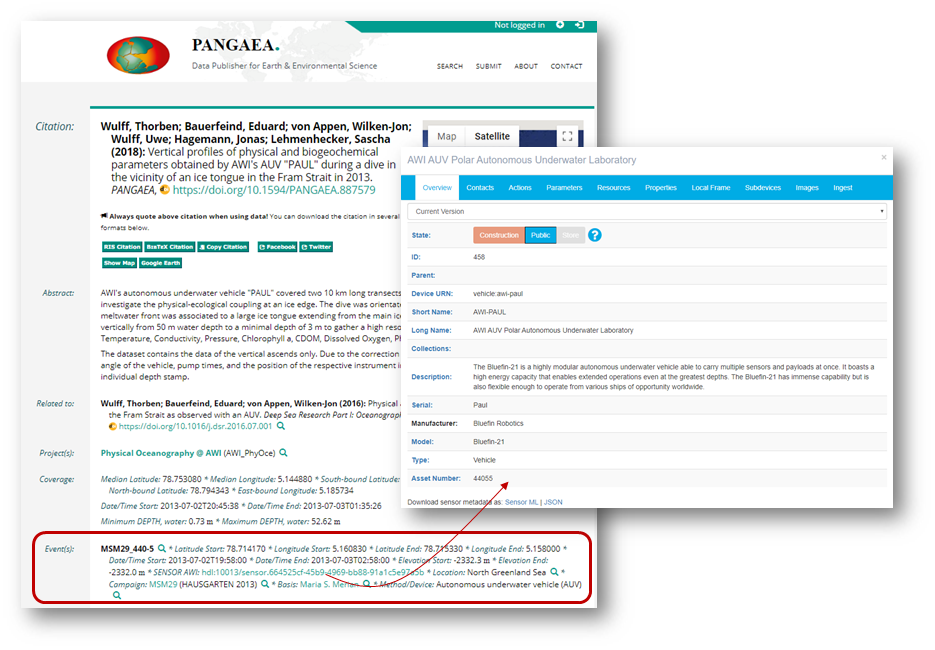
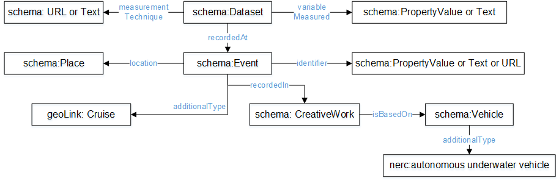
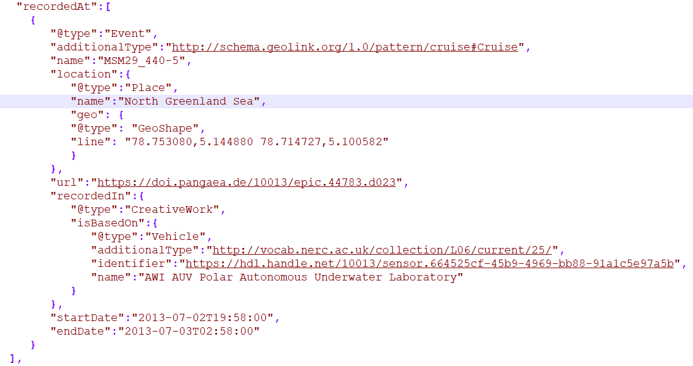

===============================================================================
Persistent Identification of Instruments (PIDINST) PID White Paper
===============================================================================

+------------------+-------------------------------------------------------------------------------+
|Document type     |Research Data Alliance (RDA) Persistent Identification of Instruments (PIDINST)|
|                  |working group output report                                                    |
+------------------+-------------------------------------------------------------------------------+
|Version           |1.0                                                                            |
+------------------+-------------------------------------------------------------------------------+
|Date              |15 July 2020                                                                   |
+------------------+-------------------------------------------------------------------------------+

Contributors
============

*Louise Darroch* (louise.darroch@bodc.ac.uk, https://orcid.org/0000-0003-4163-9575),
British Oceanographic Data Centre, National Oceanography Centre, 
Liverpool, L3 5DA, United Kingdom

*Robert Huber* (rhuber@uni-bremen.de, https://orcid.org/0000-0003-3000-0020), 
MARUM - Center for Marine Environmental Sciences, University of Bremen, Leobener Str. 8, 28359 Bremen, Germany

*Anusuriya Devaraju* (adevaraju@marum.de, https://orcid.org/0000-0003-0870-3192),
MARUM - Center for Marine Environmental Sciences, University of Bremen, Leobener Str. 8, 28359 Bremen, Germany and
PANGAEA - Center for Marine Environmental Sciences (MARUM), University of Bremen, Leobener Str. 8, 28359 Bremen, Germany

*Ulrich Schwardmann* (ulrich.schwardmann@gwdg.de, https://orcid.org/0000-0001-6337-8674),
GWDG, Gesellschaft für wissenschaftliche Datenverarbeitung Göttingen, Am
Fassberg 11, 37077 Göttingen, Germany

*Anita Bandrowski* (abandrowski@ucsd.edu, https://orcid.org/0000-0002-5497-0243),
Department of Neuoscience, University of California at San Diego, 
9500 Gilman Drive La Jolla, CA 92093-0662

*Markus Stocker* (markus.stocker@tib.eu, https://orcid.org/0000-0001-5492-3212),
TIB Leibniz Information Centre for Science and Technology, Welfengarten
1 B, 30167 Hannover, Germany and PANGAEA, Center for Marine
Environmental Sciences (MARUM), University of Bremen, Leobener Str. 8,
28359 Bremen, Germany

*Rolf Krahl* (rolf.krahl@helmholtz-berlin.de, https://orcid.org/0000-0002-1266-3819),
Helmholtz-Zentrum Berlin für Materialien und Energie GmbH,
Albert-Einstein-Str. 15, 12489 Berlin, Germany

*Ted Habermann* (ted@tedhabermann.com, http://orcid.org/0000-0003-3585-6733),
Metadata Game Changers, 3980 Broadway, Suite 103-185, Boulder,
Colorado, USA 80304

*Claudio D'Onofrio* (claudio.donofrio@nateko.lu.se, https://orcid.org/0000-0002-1982-3889),
ICOS Carbon Portal, Lund University, Physical Geography & Ecosystem
Science, Sölvegatan 12, 223 62 Lund, Sweden

*Maggie Hellström* (margareta.hellstrom@nateko.lu.se, https://orcid.org/0000-0002-4154-2610),
ICOS Carbon Portal, Physical Geography & Ecosystem Science, Lund
University, Sölvegatan 12, 223 62 Lund, Sweden

*Ingemar Häggström* (ingemar.haggstrom@eiscat.se, https://orcid.org/0000-0003-1070-6915),
EISCAT Scientific Association, Box 812, 98128 Kiruna, Sweden

*Roland Koppe* (roland.koppe@awi.de, https://orcid.org/0000-0002-2826-3932),
Computing and Data Centre, Alfred Wegener Institute Helmholtz Centre for
Polar and Marine Research. Am Handelshafen 12, 27570, Bremerhaven,
Germany

*Ana Macario* (ana.macario@awi.de, https://orcid.org/0000-0003-3747-793X),
Computing and Data Centre, Alfred Wegener Institute Helmholtz Centre for
Polar and Marine Research. Am Handelshafen 12, 27570, Bremerhaven,
Germany

*Tina Dohna* (tdohna@marum.de, https://orcid.org/0000-0002-5948-0980), 
MARUM - Center for Marine Environmental Sciences, University of Bremen, Leobener Str. 8, 28199 Bremen, Germany

*The Research Data Alliance Persistent Identification of Instruments
Working Group members* (https://www.rd-alliance.org/node/57186/members)

Table of contents
=================

`1 Overview <#overview>`__

`2 Instrument PIDs <#instrument-pids>`__

`3 Publishing new instrument PIDs <#publishing-new-instrument-pids>`__

`4 PIDINST metadata schema <#pidinst-metadata-schema>`__

   `4.1 Using common terminologies <#using-common-terminologies>`__

   `4.2 Using other PIDs <#using-other-pids>`__

   `4.2.1 RRIDs <#rrids>`__

`5 Registration <#registration>`__

   `5.1 Central registration at PID
   providers <#central-registration-at-pid-providers>`__

   `5.2 Local registration at institutional instrument
   providers <#local-registration-at-institutional-instrument-providers>`__

`6 Dealing with duplication <#dealing-with-duplication>`__

`7 Linking physical objects <#linking-physical-objects>`__

`8 When to create a new PID? <#when-to-create-a-new-pid>`__

`9 Landing page content <#landing-page-content>`__

`10 Landing page encoding <#landing-page-encoding>`__

   `10.1 Examples <#examples>`__

   `10.1.1 JSON-LD <#json-ld>`__

   `10.1.2 Sensor web enablement (SWE) <#sensor-web-enablement-swe>`__

   `10.2 Content negotiation <#content-negotiation>`__

`11 Linking instrument PIDs to
datasets <#linking-instrument-pids-to-datasets>`__

   `11.1 schema.org <#schema.org>`__

   `11.2 NetCDF4 <#netcdf4>`__

`12 Current, planned and potential
adoption <#current-planned-and-potential-adoption>`__

   `12.1 Helmholtz-Zentrum Berlin für Materialien und Energie
   (HZB) <#helmholtz-zentrum-berlin-für-materialien-und-energie-hzb>`__

   `12.2 British Oceanographic Data Centre
   (BODC) <#british-oceanographic-data-centre-bodc>`__

   `12.3 EISCAT3D <#eiscat3d>`__

   `12.4 SENSOR.awi.de and PANGAEA <#sensor.awi.de-and-pangaea>`__

   `12.5 ICOS <#icos>`__

1 Overview
==========

This white paper provides recommendations for the use of instrument
Persistent Identifiers (PIDs) for institutional instrument providers,
such as bodies who fund, maintain or provide instruments, or are
responsible for maintaining information about or data from instruments.
Institutional instrument providers will be responsible for maintaining
and publishing instrument PIDs locally, potentially on behalf of other
institutional instrument providers. These recommendations are compiled
through the activities of the Research Data Alliance (RDA) Persistent
Identification of Instruments (PIDINST) Working
Group [1]_, [2]_. This document is expected to evolve with
new user requirements and working group activities.

2 Instrument PIDs
=================

The PIDINST PID is used to identify measuring instruments, defined by
the Joint Committee for Guides in Metrology (JCGM) as “device used for
making measurements, alone or in conjunction with one or more
supplementary devices” (VIM, 2012). It is used to identify the devices
themselves (instances), the real-world assets with instantaneous
capabilities and configurations, rather than the identification of
material instrument designs (models).

3 Publishing new instrument PIDs
================================

To create new PIDs and assign them to instruments, institutional
instrument providers will submit a metadata record following the PIDINST
metadata schema and a URL for the landing page of the instrument to a
PID provider that is compliant with RDA PIDINST recommendations. Thus,
it is necessary to become a member of the PID provider to publish PIDs
directly, or work with one of their current members or registration
repositories to publish PIDs on behalf of the institutional instrument
provider. Current PID providers known to be suitable with RDA PIDINST
are ePIC [3]_ and DataCite [4]_, but PIDINST is not limited to these
providers; others may implement the schema, too.

4 PIDINST metadata schema
=========================

The PIDINST metadata schema consists of common metadata properties that
are used to consistently and accurately identify instruments across
networks and infrastructures. Thus, in support of unambiguous
identification, we recommend that an instrument’s associated metadata is
published in a common language, specifically US English. Currently, two
variants of the metadata schema exist. The original PIDINST schema [5]_,
based on the evaluation of use cases collected by the working group, is
used for prototypical implementation of metadata properties in the ePIC
infrastructure. A second variant provides a mapping between PIDINST
metadata properties and DataCite Metadata Schema 4.3 [6]_.

4.1 Using common terminologies
------------------------------

Common terminologies such as controlled vocabularies, taxonomies or
ontologies, are sets of standardised terms that solve the problem of
ambiguities associated with metadata markup and enable records to be
shared and interpreted semantically by computers. Many terminologies
exist, covering a broad spectrum of disciplines and their best
practices. The PIDINST schema is designed to complement
multidisciplinary best practices for property values. Many properties
allow for soft-typing (e.g. *ownerName*), giving users the ability to
use values of their choice, such as free text or domain-specific
terminologies. Property attributes enable users and machines to
understand the context of the value (e.g., *ownerIdentifier*,
*ownerIdentifierType*), again using free text or standardised
terminologies. While free text is allowed, institutions should consider
using common terminologies where practical to enhance the (semantic)
interoperability of PID records, particularly where they form part of
domain-specific best practice. For example, a comprehensive set of
terminologies that describe *instrumentType* or the recently added
*Model* (via *modelIdentifier*) are used widely in the Earth science
marine domain (`http://vocab.nerc.ac.uk/collection/L22/current/ <http://vocab.nerc.ac.uk/collection/L22/current/>`_,
`http://vocab.nerc.ac.uk/collection/L05/current/ <http://vocab.nerc.ac.uk/collection/L05/current/>`_).
An example of the use of common terminologies in ePID records is shown
in Table 4.1.

**Table 4.1:** Handle record of instrument identifier
http://hdl.handle.net/21.T11998/0000-001A-3905-F displaying the use of
common terminologies to identify instrument metadata compliant with the
PIDINST schema as implemented by ePIC. The terminologies used are
published on the NERC Vocabulary Server (NVS) [7]_. The data for each
metadata property is provided in JSON. The Handle record can be viewed
at http://hdl.handle.net/21.T11998/0000-001A-3905-F?noredirect

+-------------------------------------------------------+---------------------------------------------------------------------------------------------+
| Type                                                  | Data                                                                                        |
+=======================================================+=============================================================================================+
| URL                                                   | .. code-block:: JSON                                                                        |
|                                                       |                                                                                             |
|                                                       |     https://linkedsystems.uk/system/instance/TOOL0022_2490/current/                         |
+-------------------------------------------------------+---------------------------------------------------------------------------------------------+
| 21.T11148/8eb858ee0b12e8e463a5 (Identifier)           | .. code-block:: JSON                                                                        |
|                                                       |                                                                                             |
|                                                       |     {                                                                                       |
|                                                       |       "identifierValue":"http://hdl.handle.net/21.T11998/0000-001A-3905-F",                 |
|                                                       |       "identiferType":"MeasuringInstrument"                                                 |
|                                                       |     }                                                                                       |
+-------------------------------------------------------+---------------------------------------------------------------------------------------------+
| 21.T11148/9a15a4735d4bda329d80 (LandingPage)          | .. code-block:: JSON                                                                        |
|                                                       |                                                                                             |
|                                                       |     https://linkedsystems.uk/system/instance/TOOL0022_2490/current/                         |
+-------------------------------------------------------+---------------------------------------------------------------------------------------------+
| 21.T11148/709a23220f2c3d64d1e1 (Name)                 | .. code-block:: JSON                                                                        |
|                                                       |                                                                                             |
|                                                       |     Sea-Bird SBE 37-IM MicroCAT C-T Sensor                                                  |
+-------------------------------------------------------+---------------------------------------------------------------------------------------------+
| 21.T11148/4eaec4bc0f1df68ab2a7 (Owners)               | .. code-block:: JSON                                                                        |
|                                                       |                                                                                             |
|                                                       |     [{                                                                                      |
|                                                       |       "Owner": {                                                                            |
|                                                       |         "ownerName":"National Oceanography Centre",                                         |
|                                                       |         "ownerContact":"louise.darroch@bodc.ac.uk",                                         |
|                                                       |         "ownerIdentifier":{                                                                 |
|                                                       |           "ownerIdentifierValue":                                                           |
|                                                       |             "http://vocab.nerc.ac.uk/collection/B75/current/ORG00009/",                     |
|                                                       |           "ownerIdentifierType":"URL"                                                       |
|                                                       |          }                                                                                  |
|                                                       |        }                                                                                    |
|                                                       |     }]                                                                                      |
+-------------------------------------------------------+---------------------------------------------------------------------------------------------+
| 21.T11148/1f3e82ddf0697a497432 (Manufacturers)        | .. code-block:: JSON                                                                        |
|                                                       |                                                                                             |
|                                                       |     [{                                                                                      |
|                                                       |       "Manufacturer":{                                                                      |
|                                                       |         "manufacturerName":"Sea-Bird Scientific",                                           |
|                                                       |         "modelName":"SBE 37-IM",                                                            |
|                                                       |         "manufacturerIdentifier":{                                                          |
|                                                       |           "manufacturerIdentifierValue":                                                    |
|                                                       |             "http://vocab.nerc.ac.uk/collection/L35/current/MAN0013/",                      |
|                                                       |           "manufacturerIdentifierType":"URL"                                                |
|                                                       |         }                                                                                   |
|                                                       |       }                                                                                     |
|                                                       |     }]                                                                                      |
+-------------------------------------------------------+---------------------------------------------------------------------------------------------+
| 21.T11148/55f8ebc805e65b5b71dd (Description)          | .. code-block:: JSON                                                                        |
|                                                       |                                                                                             |
|                                                       |     A high accuracy conductivity and temperature recorder with an optional pressure sensor  |
|                                                       |     designed for deployment on moorings. The IM model has an inductive modem for real-time  |
|                                                       |     data transmission plus internal flash memory data storage.                              |
+-------------------------------------------------------+---------------------------------------------------------------------------------------------+
| 21.T11148/f76ad9d0324302fc47dd (InstrumentType)       | .. code-block:: JSON                                                                        |
|                                                       |                                                                                             |
|                                                       |     http://vocab.nerc.ac.uk/collection/L22/current/TOOL0022/                                |
+-------------------------------------------------------+---------------------------------------------------------------------------------------------+
| 21.T11148/72928b84e060d491ee41 (MeasuredVariables)    | .. code-block:: JSON                                                                        |
|                                                       |                                                                                             |
|                                                       |     [{                                                                                      |
|                                                       |       "MeasuredVariable":{                                                                  |
|                                                       |         "VariableMeasured":                                                                 |
|                                                       |           "http://vocab.nerc.ac.uk/collection/P01/current/CNDCPR01/"                        |
|                                                       |       }                                                                                     |
|                                                       |     },{                                                                                     |
|                                                       |       "MeasuredVariable":{                                                                  |
|                                                       |         "VariableMeasured":                                                                 |
|                                                       |           "http://vocab.nerc.ac.uk/collection/P01/current/PSALPR01/"                        |
|                                                       |       }                                                                                     |
|                                                       |     },{                                                                                     |
|                                                       |       "MeasuredVariable":{                                                                  |
|                                                       |         "VariableMeasured":                                                                 |
|                                                       |           "http://vocab.nerc.ac.uk/collection/P01/current/TEMPPR01/"                        |
|                                                       |       }                                                                                     |
|                                                       |     },{                                                                                     |
|                                                       |       "MeasuredVariable":{                                                                  |
|                                                       |         "VariableMeasured":                                                                 |
|                                                       |           "http://vocab.nerc.ac.uk/collection/P01/current/PREXMCAT/"                        |
|                                                       |       }                                                                                     |
|                                                       |     }]                                                                                      |
+-------------------------------------------------------+---------------------------------------------------------------------------------------------+
| 21.T11148/22c62082a4d2d9ae2602 (Dates)                | .. code-block:: JSON                                                                        |
|                                                       |                                                                                             |
|                                                       |     [{                                                                                      |
|                                                       |       "date":{                                                                              |
|                                                       |         "date":"1999-11-01",                                                                |
|                                                       |         "dateType":"Commissioned"                                                           |
|                                                       |       }                                                                                     |
|                                                       |     }]                                                                                      |
+-------------------------------------------------------+---------------------------------------------------------------------------------------------+
| 21.T11148/eb3c713572f681e6c4c3 (AlternateIdentifiers) | .. code-block:: JSON                                                                        |
|                                                       |                                                                                             |
|                                                       |     [{                                                                                      |
|                                                       |       "AlternateIdentifier":{                                                               |
|                                                       |         "AlternateIdentifierValue":"2490",                                                  |
|                                                       |         "alternateIdentifierType":"serialNumber"                                            |
|                                                       |       }                                                                                     |
|                                                       |     }]                                                                                      |
+-------------------------------------------------------+---------------------------------------------------------------------------------------------+
| 21.T11148/178fb558abc755ca7046 (RelatedIdentifiers)   | .. code-block:: JSON                                                                        |
|                                                       |                                                                                             |
|                                                       |     [{                                                                                      |
|                                                       |       "RelatedIdentifier":{                                                                 |
|                                                       |         "RelatedIdentifierValue":                                                           |
|                                                       |           "https://www.bodc.ac.uk/data/documents/nodb/pdf/37imbrochurejul08.pdf",           |
|                                                       |         "RelatedIdentifierType": "URL",                                                     |
|                                                       |         "relationType":"IsDescribedBy "                                                     |
|                                                       |       }                                                                                     |
|                                                       |     }]                                                                                      |
+-------------------------------------------------------+---------------------------------------------------------------------------------------------+

4.2 Using other PIDs
--------------------

4.2.1 RRIDs
~~~~~~~~~~~

In a similar way to common terminologies, persistent identifiers have
been created to help users classify and accurately describe physical
objects. A related PID is the RRID, research resource identifier, which
identifies the classes of instruments (models) and not instances [8]_.
This work is undertaken by the UsedIT group [9]_, which is extending the
RRID to instrument classes that could be used to describe the *Model*
(via *modelIdentifier*) property (Table 4.2). RRIDs are not described in
detail here, but it is envisioned that the RRID metadata schema, which
was described in detail previously [10]_, and extended by UsedIT [11]_,
will be interoperable with instrument instance (PIDINST) PIDs. This
interoperability should enable any project to quickly download data
about the model to consistently fill mapped fields.

Why RRIDs? RRIDs are currently used in about 1000 journals to tag
classes of research resources (including reagents like antibodies or
plasmids, organisms, cell lines, and a relatively broad category of
“tools” which includes software tools and services such as university
core facilities, but recently has been extended to physical tools such
as models of sequencers or microscopes). Because RRIDs were created as
an agreement between a group of biological journals and the National
Institutes of Health, they are most commonly found and linked in the
biological sciences literature (e.g., Cell, eLife), they are part of the
JATS NISO standard, STAR Methods, and the MDAR pan-publisher
reproducibility checklist, resolved by identifiers.org and the n2t
resolver and echoed by some of the major reagent providers (e.g., Thermo
Fisher, Addgene, and the MMRRC mouse repository).

**Table 4.2:** Example showing the use of RRIDs in the PIDINST metadata
schema.

+----------+------------------------+---------------+---------+----------------------------------------------------+--------------------------------------------+
|          |                        |               |         |                                                    |                                            |
| ID       | Property               | Obligation    | Occ.    | Definition                                         | Allowed values, constraints, remarks       |
+==========+========================+===============+=========+====================================================+============================================+
|          |                        |               |         |                                                    |                                            |
| 6        | Model                  | R             | 0-1     | Name of the model or type of device as attributed  | Element                                    |
|          |                        |               |         | by the manufacturer                                |                                            |
+----------+------------------------+---------------+---------+----------------------------------------------------+--------------------------------------------+
|          |                        |               |         |                                                    |                                            |
| 6.1      | modelName              | R             | 1       | Full name of the model                             | Name field from RRID                       |
|          |                        |               |         |                                                    |                                            |
|          |                        |               |         |                                                    | E.g.                                       |
|          |                        |               |         |                                                    |                                            |
|          |                        |               |         |                                                    | ‘Illumina HiSeq 3000/HiSeq 4000 System’    |
+----------+------------------------+---------------+---------+----------------------------------------------------+--------------------------------------------+
|          |                        |               |         |                                                    |                                            |
| 6.2      | modelIdentifier        | O             | 0-1     | Persistent identifier of the model                 | RRID identifier                            |
|          |                        |               |         |                                                    |                                            |
|          |                        |               |         |                                                    | E.g.                                       |
|          |                        |               |         |                                                    |                                            |
|          |                        |               |         |                                                    | ‘RRID:SCR_016386’                          |
+----------+------------------------+---------------+---------+----------------------------------------------------+--------------------------------------------+
|          |                        |               |         |                                                    |                                            |
| 6.2.1    | modelIdentifierType    | O             | 1       | Type of the identifier                             | Free text; must be identifier type         |
|          |                        |               |         |                                                    |                                            |
|          |                        |               |         |                                                    | E.g. ‘RRID’                                |
+----------+------------------------+---------------+---------+----------------------------------------------------+--------------------------------------------+

5 Registration 
==============

5.1 Central registration at PID providers
-----------------------------------------

The following resources (Table 5.1) provide technical guidance for
institutions to publish and manage PID records at PID providers
compliant with RDA PIDINST recommendations.

**Table 5.1:** Technical guidance for publishing and managing instrument
PIDs at PID providers compliant with RDA PIDINST recommendations. The
table provides links to the relevant metadata schema that accompanies
PID records at PID providers.

+--------------+---------------------------------------------------------------------------------+--------------------------------------------------------------------------------------------------+
| PID provider | Technical resource                                                              | Metadata schema                                                                                  |
+==============+=================================================================================+==================================================================================================+
| ePIC         | https://github.com/rdawg-pidinst/White-paper/blob/master/RdaPidinstCookbook.rst | `PIDINST <https://github.com/rdawg-pidinst/schema/blob/master/schema.rst>`_                      |
+--------------+---------------------------------------------------------------------------------+--------------------------------------------------------------------------------------------------+
| DataCite     | https://datacite.org/dois.html                                                  | `PIDINST to DataCite <https://github.com/rdawg-pidinst/schema/blob/master/schema-datacite.rst>`_ |
+--------------+---------------------------------------------------------------------------------+--------------------------------------------------------------------------------------------------+

5.2 Local registration at institutional instrument providers
------------------------------------------------------------

In order to register instrument PIDs at a provider service,
institutional instrument providers must publish a landing page for each
instrument PID to resolve to. These publications might be encoded using
standard markup languages (e.g. HTML), structured, machine-actionable
web resources (e.g. World Wide Consortium’s (W3C) Linked Data), or
specialist standards for describing instruments and their inherited
properties and processes (e.g. Open Geospatial Consortium’s (OGC)
SensorML, W3C Semantic Sensor Network (SSN) ontology). Whichever method
of publication is used, it is necessary to ensure there is enough
metadata on landing pages to unambiguously identify the instrument (see
`Landing page content <#landing-page-content>`__). The URL address is
also used to populate the *LandingPage* property of the PIDINST
schema [12]_, adding this locator to the PID’s metadata record.

6 Dealing with duplication
==========================

Duplication between identifier records is not a new problem and is
common to many applications (e.g. bibliographic, medical records). While
PIDINST identifiers are considered globally persistent it is accepted
that duplication may occur particularly where institutions loan
instruments to other organisations or provide access to specialised
facilities (e.g. large scale synchrotrons, medical laboratories,
computational facilities). Such duplication may lead to inaccurate
statistics or reporting about instrument assets.

It is recommended that owners of instruments try to employ workflows and
procedures that avoid duplication in the first instance. Where this has
not been possible, it is recommended that instrument owners employ
deduplication, effectively merging duplicate records into one
representative record by ensuring links between them. This can be
achieved using the PIDINST metadata schema *relatedIdentifier* property
with a *relationType* attribute *IsIdenticalTo* as shown in Snippet 6.1.

(1)

.. code-block:: XML
   
      <relatedIdentifiers>
         <relatedIdentifier relatedIdentifierType="DOI" relationType="IsIdenticalTo">10.4232/10.CPoS-2013-02en</relatedIdentifier>
      </relatedIdentifiers>

(2)

.. code-block:: JSON
  
    [{
       "RelatedIdentifier":{
          "RelatedIdentifierValue":"10.4232/10.CPoS-2013-02en",
          "RelatedIdentifierType": "DOI",
          "relationType":"IsIdenticalTo"
          }
      }]

**Snippet 6.1:** Merging duplicate instrument PID records using (1) XML
and (2) JSON

Recent advances in technologies are expanding to algorithms that
automatically detect and resolve deduplication. While such methodologies
have been known to improve the efficiency of detection in large
collections such as Google Scholar or OpenAire Research Graph,
algorithms may be limited by heterogeneous representations for example,
by the use of differing semantics. While automatic detection is
encouraged, the PIDINST schema is designed to complement
multidisciplinary best practices for property values and many properties
allow for soft-typing, giving users the ability to use values of their
choice, such as free text or domain-specific standards.

7 Linking physical objects
==========================

Instruments and their individual configuration represent the major
reference for the origin of a broad spectrum of data. As such, both
become part of the Internet of Things (IoT) and therefore it is of key
importance for related identification mechanisms to enable physical
access to these objects in addition to their digital representations or
catalogue metadata. Thus, to ultimately allow the “mapping the real
world into the virtual world”  [13]_. This kind of access is essential
to reproduce science as it allows us to compare experimental setup and
to repeat analyses.

The most trivial but failsafe method to link physical objects with their
virtual representation would be to permanently label an instrument by
writing or engraving its PID onto it or its container along with its
inventory number and serial number. Because space for labels is limited
on smaller sensors, modern QR tags or barcodes may be more convenient as
they offer the possibility to encode any identifying information in a
machine readable way. A recommended way would be to use QR codes to
embed a PID’s actionable URIs (Figure 7.1). Ideally such a QR badge
additionally displays the PID as well as the inventory number and serial
number in a human readable way. Some QR code generators now allow users
to integrate images like organisation logos or track scanning activity
such as the GPS position when the label is scanned.

In case neither labelling of physical objects with barcodes or PID
strings is possible, linking of instruments with their digital
representation can be maintained by providing appropriate metadata
records. For instruments such linking can be achieved by capturing
identifiers which uniquely identify an instrument such as serial number
or inventory number.

While PIDINST schema metadata does not provide explicit fields for
serial numbers or inventory numbers, it currently offers a generic way
to capture any kind of identifier which can be used for this purpose.
*AlternateIdentifier* can be used to record any identifier string and
*alternateIdentifierType* to specify an identifier type (Snippet 7.1).
PIDINST schema recommends the use of the terms *serialNumber* and
*inventoryNumber.* There is on-going discussion regarding the use of
explicit fields for these properties in PIDINST.

**Figure 7.1:** An example of a webpage QR code that includes an
organisation logo and re-directs the scanner to the PID URL
(http://hdl.handle.net/21.T11998/0000-001A-3905-F).

.. code-block:: XML
  
      <AlternateIdentifiers>
         <AlternateIdentifier alternateIdentifierType="serialNumber"">7351-349l-mn24-019f</AlternateIdentifier>
      </AlternateIdentifiers>

**Snippet 7.1:** An instrument serial number expressed in XML

Besides storing e.g. serial numbers in PIDINST schema metadata, it is
highly recommended to store the instrument PID within an institutional
sensor management or inventory system immediately after PID
registration. This ensures the maintenance of links between physical
objects and their virtual representation at both endpoints, the
institutional sensor management system as well as the PID registry, and
will ensure the persistence of object linking in case of failures on
either side.

8 When to create a new PID?
===========================

Instruments can be changed or modified over time. For example, when a
component is changed or an instrument is upgraded to meet new
requirements in measurement capability. Defining the exact moment when a
new PID should be created is challenging because different stakeholders
will have different reasons for each evolution. Indeed the PIDINST WG
has not been able to settle on a definitive answer. Thus to accommodate
varying stakeholder needs, it is recommended that a PID will evolve when
there is a significant change in context that is important to an
institutional instrument provider. Significant changes might include
when an instrument is cited in the literature and changes, there is a
need to preserve the instrument history, major changes in measurement
capability that affect automated workflows such as quality control, or
modifications to an instrument’s firmware etc. Whatever the reason an
institution chooses to create new PIDs, it is recommended that
instrument providers identify the succession in the PIDINST metadata
schema using the *relatedIdentifier* property with a *relationType*
attribute *IsNewVersionOf* for the new PID and, *IsPreviousVersionOf*
for the superceded PID as shown in Snippet 8.1 and 8.2.

(1)

.. code-block:: XML

      <relatedIdentifiers>
         <relatedIdentifier relatedIdentifierType="DOI" relationType="IsNewVersionOf">10.4232/10.CPoS-2013-02en</relatedIdentifier>
      </relatedIdentifiers>

(2)

.. code-block:: XML

      <relatedIdentifiers>
         <relatedIdentifier relatedIdentifierType="DOI" relationType="IsPreviousVersionOf">http://hdl.handle.net/21.T11998/0000-001A-3905-F</relatedIdentifier>
      </relatedIdentifiers>

**Snippet 8.1:** The use of the relatedIdentifier property to represent
(1) superseding and (2) superseded PID records in XML

(1)

.. code-block:: JSON

      [{
        "RelatedIdentifier":{
          "RelatedIdentifierValue":"10.4232/10.CPoS-2013-02en",
          "RelatedIdentifierType": "DOI",
          "relationType":"IsNewVersionOf"
        }
      }]

(2)

.. code-block:: JSON

      [{
        "RelatedIdentifier":{
          "RelatedIdentifierValue":"http://hdl.handle.net/21.T11998/0000-001A-3905-F",
          "RelatedIdentifierType": "DOI",
          "relationType":"IsPreviousVersionOf"
        }
      }]

**Snippet 8.2:** The use of the relatedIdentifier property to represent
(1) superseding and (2) superseded PID records in JSON

9 Landing page content
======================

It is recommended that instrument providers use enough information
(metadata) on landing pages to unambiguously identify the instrument.
Ideally, landing pages should include the metadata specified in the
schema for PID providers and use common terminology where practical to
aid interoperability (see `Using common
terminology\ section <#using-common-terminologies>`__). Institutions
should also consider providing links to the metadata record that
accompanies PIDs published at PID providers to aid metadata exchange
(e.g. DataCite XML).

Tables 9.1and 9.2 provide recommendations for some additional, more
descriptive metadata that can be published on landing pages. Together
with the PIDINST metadata schema, they are designed to complement the
administration and discovery of instruments; to enable users to put data
into context; and to automate instrument metadata into data workflows.

**Table 9.1:** Descriptive landing page metadata describing measuring
instruments. To be used in conjunction with the core instrument metadata
used in the PIDINST schema.

+-------------------+-------------------------------------------------+
| **Metadata type** | **Comments**                                    |
+===================+=================================================+
| Model version     | A variant of an instrument model. While the     |
|                   | design of an instrument remains largely the     |
|                   | same, variants are available with minor changes |
|                   | to suit different applications. For example, an |
|                   | instrument may be available with different      |
|                   | housing material from the standard design,      |
|                   | allowing the instrument to be used in more      |
|                   | dynamic environments such as extreme pressures  |
|                   | or weather conditions.                          |
+-------------------+-------------------------------------------------+
| Documents         | Descriptive or supporting documentation such as |
|                   | manuals, data sheets, scientific references     |
|                   | etc.                                            |
+-------------------+-------------------------------------------------+
| Classifications   | Properties that categorise instruments. In      |
|                   | addition to instrument type, these properties   |
|                   | can describe aspects such as the intended       |
|                   | applications, operating principles, whether the |
|                   | instrument is a compound instrument or a        |
|                   | component etc.                                  |
+-------------------+-------------------------------------------------+

**Table 9.2:** Descriptive, landing page metadata that describes the
history of events, operations or changes during the lifetime of an
instrument. This kind of metadata should be associated to dates and
ideally accompanied by comments. To be used in conjunction with the core
instrument metadata used in the PIDINST schema.

+--------------------+------------------------------------------------+
| **Metadata type**  | **Comments**                                   |
+====================+================================================+
| Calibrations       | Many instruments are calibrated to convert raw |
|                    | outputs to meaningful units or to correct for  |
|                    | data uncertainty. It is highly recommended to  |
|                    | store the calibration date and type. It may    |
|                    | also be useful to store the coefficients,      |
|                    | algorithm used and calibration certificates.   |
+--------------------+------------------------------------------------+
| Capabilities       | Capabilities are properties that further       |
|                    | quantify or qualify an instrument’s outputs    |
|                    | (e.g. detection limits, accuracy, precision,   |
|                    | operating ranges etc.).                        |
+--------------------+------------------------------------------------+
| Characteristics    | Properties that describe features and          |
|                    | qualities belonging to an instrument. (e.g.    |
|                    | weight, size, housing material, components,    |
|                    | firmware etc.).                                |
+--------------------+------------------------------------------------+
| Servicing          | Descriptions of maintenance procedures carried |
|                    | out on the instrument.                         |
+--------------------+------------------------------------------------+
| Funding references | Identifiers or names of funding resources      |
+--------------------+------------------------------------------------+
| Ownership dates    | Ownership start and end dates                  |
+--------------------+------------------------------------------------+

10 Landing page encoding
========================

Landing page web resources can be written in any format (e.g. HTML,
XML). Although not obligatory, ideally resources should be encoded in
formats that not only improve syntactic interpretation of information
but semantic understanding of the information. In other words, machines
can not only read but understand the meaning of the information
presented in web resources, enhancing interoperability and integration
between systems. Below are some examples of landing page encodings.

10.1 Examples
-------------

10.1.1 JSON-LD
~~~~~~~~~~~~~~

There is a strong relation between PIDs with values of types that are
defined in a data type registry (DTR) as for instance in the NERC
example in table 4.1 and linked data. First of all a PID with a type
value is a triple where the PID plays the role of the subject, the type
definition is the predicate and the value is the object. Secondly the
type definition itself can refer to sub types also defined in a DTR. If
this construction of types out of other types is done in a consistent
and machine actionable way, as it is done for instance in the ePC DTR,
these subtypes may be referred by human readable names. The names are
disambiguated by the type definition, because each subtype used in a
type is identified by a PID. Such PIDs with types defined upon sub types
span a graph of metadata around the PID. PIDs with types are in other
words a specific representation of linked data.

It is therefore obvious to ask for other, more a common linked data
representation like RDF or JSON-LD of such PIDs with types. Such a
conversion can be done by a simple backtracking algorithm that crawls
from the PID through all its type and subtypes definitions to identify
the used names by the type PIDs and to collect this information for the
LD representation. This way the whole graph is explored and this graph
can be mapped into a linked data representation. In the following a
respective representation in JSON-LD of the schema example shown in
table 4.1 is shown in snippet 10.1.

.. code-block:: JSON
  
        {
        "@context" : {
         "ARK-Identifier" : "dti:21.T11148/7af6f46512fb4c190d01",
         "AlternateIdentifier" : "dti:21.T11148/d87a75c52c68b06e9a18",
         "AlternateIdentifierValue" : "dti:21.T11148/38330bcc6a40ca85e5b4",
         "AlternateIdentifiers" : "dti:21.T11148/eb3c713572f681e6c4c3",
         "Bibcode-Identifier" : "dti:21.T11148/6c2fc7682e48ac7160b5",
         "DOI-Identifier-General" : "dti:21.T11148/d93427e3c56173e9dc08",
         "Date" : "dti:21.T11148/eb9a4bc1c0c153e4e4b0",
         "Dates" : "dti:21.T11148/22c62082a4d2d9ae2602",
         "Description" : "dti:21.T11148/55f8ebc805e65b5b71dd",
         "Handle-Identifier-ASCII" : "dti:21.T11148/3626040cadcac1571685",
         "ISAN-Identifier" : "dti:21.T11148/48cfce4482166a103c50",
         "ISBN-Identifier" : "dti:21.T11148/2ff8ad6cdd4e46622944",
         "ISNI-Identifier" : "dti:21.T11148/cff32964e132c14fc56f",
         "ISRC-Identifier" : "dti:21.T11148/2719170925ff2bfb5157",
         "ISSN-Identifier" : "dti:21.T11148/7e689432354610f388c0",
         "ISTC-Identifier" : "dti:21.T11148/1f0df9ef66774b2e2aa1",
         "ISWC-Identifier" : "dti:21.T11148/698fba7e1c659fcfdcdd",
         "InstrumentType" : "dti:21.T11148/f76ad9d0324302fc47dd",
         "LandingPage" : "dti:21.T11148/9a15a4735d4bda329d80",
         "Manufacturer" : "dti:21.T11148/7adfcd13b3b01de0d875",
         "Manufacturers" : "dti:21.T11148/1f3e82ddf0697a497432",
         "MeasuredVariable" : "dti:21.T11148/1fcb0dad9aced457d67e",
         "MeasuredVariables" : "dti:21.T11148/72928b84e060d491ee41",
         "Name" : "dti:21.T11148/709a23220f2c3d64d1e1",
         "Owner" : "dti:21.T11148/89ff31225c5f042fff61",
         "Owners" : "dti:21.T11148/4eaec4bc0f1df68ab2a7",
         "PMCID-Identifier" : "dti:21.T11148/e94bec7d7f1c63dd00cd",
         "PMID-Identifier" : "dti:21.T11148/234c084bac48480bfe5d",
         "RelatedIdentifier" : "dti:21.T11148/ec9f00af0761a065dbd0",
         "RelatedIdentifierType" : "dti:21.T11148/015dc79a77940fb65aa4",
         "RelatedIdentifierValue" : "dti:21.T11148/38330bcc6a40ca85e5b4",
         "RelatedIdentifiers" : "dti:21.T11148/178fb558abc755ca7046",
         "URN-Identifier" : "dti:21.T11148/d22b6854df3503df7831",
         "VariableMeasured" : "dti:21.T11148/f1627ce85386d8d75078",
         "alternateIdentifierType" : "dti:21.T11148/015dc79a77940fb65aa4",
         "arXiv-Identifier" : "dti:21.T11148/d66f8368c3d305941a2e",
         "date" : "dti:21.T11148/be707495360a234ef049",
         "dateType" : "dti:21.T11148/2f0e608b621a5a97e0d9",
         "dti" : "http://hdl.handle.net/",
         "identifier-general-with-type" : "dti:21.T11148/8eb858ee0b12e8e463a5",
         "identifierType" : "dti:21.T11148/015dc79a77940fb65aa4",
         "identifierValue" : "dti:21.T11148/38330bcc6a40ca85e5b4",
         "manufacturerIdentifier" : "dti:21.T11148/5b240e16ea32ea25cf65",
         "manufacturerIdentifierType" : "dti:21.T11148/015dc79a77940fb65aa4",
         "manufacturerIdentifierValue" : "dti:21.T11148/38330bcc6a40ca85e5b4",
         "manufacturerName" : "dti:21.T11148/798588c5a1ec532f737b",
         "modelName" : "dti:21.T11148/798588c5a1ec532f737b",
         "other" : "dti:21.T11148/f40cb15558a7c1546c91",
         "ownerContact" : "dti:21.T11148/a88b7dcd1a9e3e17770b",
         "ownerIdentifier" : "dti:21.T11148/1e3c17ac2a3e7ebf466a",
         "ownerIdentifierType" : "dti:21.T11148/015dc79a77940fb65aa4",
         "ownerIdentifierValue" : "dti:21.T11148/38330bcc6a40ca85e5b4",
         "ownerName" : "dti:21.T11148/798588c5a1ec532f737b",
         "relationType" : "dti:21.T11148/292a53bd9ee27a242082"
        },
        "@id" : "dti:21.T11998/0000-001A-3905-F",
        "AlternateIdentifiers" : [
         {
         "AlternateIdentifier" : {
            "AlternateIdentifierValue" : "2490",
            "alternateIdentifierType" : "serialNumber"
         }
         }
        ],
        "Dates" : [
         {
         "date" : {
            "date" : "1999-11-01",
            "dateType" : "Commissioned"
         }
         }
        ],
        "Description" : "A high accuracy conductivity and temperature recorder with an optional pressure sensor designed for deployment on moorings. The IM model has an inductive modem for real-time data transmission plus internal flash memory data storage.",
        "InstrumentType" : "http://vocab.nerc.ac.uk/collection/L22/current/TOOL0022/",
        "LandingPage" : "https://linkedsystems.uk/system/instance/TOOL0022_2490/current/",
        "Manufacturers" : [
         {
         "Manufacturer" : {
            "manufacturerIdentifier" : {
               "manufacturerIdentifierType" : "URL",
               "manufacturerIdentifierValue" : "http://vocab.nerc.ac.uk/collection/L35/current/MAN0013/"
            },
            "manufacturerName" : "Sea-Bird Scientific",
            "modelName" : "SBE 37-IM"
         }
         }
        ],
        "MeasuredVariables" : [
         {
         "MeasuredVariable" : {
            "VariableMeasured" : "http://vocab.nerc.ac.uk/collection/P01/current/CNDCPR01/"
         }
         },
         {
         "MeasuredVariable" : {
            "VariableMeasured" : "http://vocab.nerc.ac.uk/collection/P01/current/PSALPR01/"
         }
         },
         {
         "MeasuredVariable" : {
            "VariableMeasured" : "http://vocab.nerc.ac.uk/collection/P01/current/TEMPPR01/"
         }
         },
         {
         "MeasuredVariable" : {
            "VariableMeasured" : "http://vocab.nerc.ac.uk/collection/P01/current/PREXMCAT/"
         }
         }
        ],
        "Name" : "Sea-Bird SBE 37-IM MicroCAT C-T Sensor",
        "Owners" : [
         {
         "Owner" : {
            "ownerContact" : "louise.darroch@bodc.ac.uk",
            "ownerIdentifier" : {
               "ownerIdentifierType" : "URL",
               "ownerIdentifierValue" : "http://vocab.nerc.ac.uk/collection/B75/current/ORG00009/"
            },
            "ownerName" : "National Oceanography Centre"
         }
         }
        ],
        "RelatedIdentifiers" : [
         {
         "RelatedIdentifier" : {
            "RelatedIdentifierType" : "URL",
            "RelatedIdentifierValue" : "https://www.bodc.ac.uk/data/documents/nodb/pdf/37imbrochurejul08.pdf",
            "relationType" : "IsDescribedBy "
         }
         }
        ],
        "identifier-general-with-type" : {
         "identiferType" : "MeasuringInstrument",
         "identifierValue" : "http://hdl.handle.net/21.T11998/0000-001A-3905-F"
        }
      }

**Snippet 10.1:** representation in JSON-LD of the NERC example of table
4.1.

As one can see in this result the context is over complete in the sense
that all possible sub types are resolved and referred in @context, but
not all of them are actually used by the types occuring in the PID. This
could be pruned by an additional step of the algorithm to a version
reduced to the necessary and sufficient sub types. Such a pruning is
also automatically done by LD converters [14]_ as one can see in the
following snippet with a conversion into Turtle Terse RDF that results
into the following serialization (snippet 10.2), where only the values
remain and the names used in the type definitions are replaced by their
type PID suffixes::

      @prefix ns0: <http://hdl.handle.net/21.T11148/> .
      @prefix xsd: <http://www.w3.org/2001/XMLSchema#> .

      <http://hdl.handle.net/21.T11998/0000-001A-3905-F>
        ns0:178fb558abc755ca7046 [ ns0:ec9f00af0761a065dbd0 [
         ns0:015dc79a77940fb65aa4 "URL"^^xsd:string ;
         ns0:292a53bd9ee27a242082 "IsDescribedBy "^^xsd:string ;
         ns0:38330bcc6a40ca85e5b4 "https://www.bodc.ac.uk/data/documents/nodb/pdf/37imbrochurejul08.pdf"^^xsd:string
         ] ] ;
        ns0:1f3e82ddf0697a497432 [ ns0:7adfcd13b3b01de0d875 [
         ns0:5b240e16ea32ea25cf65 [
            ns0:015dc79a77940fb65aa4 "URL"^^xsd:string ;
            ns0:38330bcc6a40ca85e5b4 "http://vocab.nerc.ac.uk/collection/L35/current/MAN0013/"^^xsd:string
         ] ;
         ns0:798588c5a1ec532f737b "Sea-Bird Scientific"^^xsd:string, "SBE 37-IM"^^xsd:string
         ] ] ;
        ns0:22c62082a4d2d9ae2602 [ ns0:be707495360a234ef049 [
         ns0:2f0e608b621a5a97e0d9 "Commissioned"^^xsd:string ;
         ns0:be707495360a234ef049 "1999-11-01"^^xsd:string
         ] ] ;
        ns0:4eaec4bc0f1df68ab2a7 [ ns0:89ff31225c5f042fff61 [
         ns0:1e3c17ac2a3e7ebf466a [
            ns0:015dc79a77940fb65aa4 "URL"^^xsd:string ;
            ns0:38330bcc6a40ca85e5b4 "http://vocab.nerc.ac.uk/collection/B75/current/ORG00009/"^^xsd:string
         ] ;
         ns0:798588c5a1ec532f737b "National Oceanography Centre"^^xsd:string ;
         ns0:a88b7dcd1a9e3e17770b "louise.darroch@bodc.ac.uk"^^xsd:string
         ] ] ;
        ns0:55f8ebc805e65b5b71dd "A high accuracy conductivity and temperature recorder with an optional pressure sensor designed for deployment on moorings. The IM model has an inductive modem for real-time data transmission plus internal flash memory data storage."^^xsd:string ;
        ns0:709a23220f2c3d64d1e1 "Sea-Bird SBE 37-IM MicroCAT C-T Sensor"^^xsd:string ;
        ns0:72928b84e060d491ee41 [ ns0:1fcb0dad9aced457d67e [ ns0:f1627ce85386d8d75078 "http://vocab.nerc.ac.uk/collection/P01/current/CNDCPR01/"^^xsd:string ] ], [ ns0:1fcb0dad9aced457d67e [ ns0:f1627ce85386d8d75078 "http://vocab.nerc.ac.uk/collection/P01/current/PSALPR01/"^^xsd:string ] ], [ ns0:1fcb0dad9aced457d67e [ ns0:f1627ce85386d8d75078 "http://vocab.nerc.ac.uk/collection/P01/current/TEMPPR01/"^^xsd:string ] ], [ ns0:1fcb0dad9aced457d67e [ ns0:f1627ce85386d8d75078 "http://vocab.nerc.ac.uk/collection/P01/current/PREXMCAT/"^^xsd:string ] ] ;
        ns0:8eb858ee0b12e8e463a5 [ ns0:38330bcc6a40ca85e5b4 "http://hdl.handle.net/21.T11998/0000-001A-3905-F"^^xsd:string ] ;

**Snippet 10.2:** representation in Turtle Terse RDF of the NERC example
of table 4.1 that was generated by a JSON-LD to RDF converter from the
JSON-LD in snippet 10.1.

10.1.2 Sensor web enablement (SWE)
~~~~~~~~~~~~~~~~~~~~~~~~~~~~~~~~~~

Global standards have been developed which enable the web-based
discovery, exchange and processing of sensors and their observations.
Many developers using standards, such as the Open Geospatial
Consortium’s (OGC) Sensor Web Enablement (SWE), publish formal,
machine-readable descriptions of sensors and their technical information
as web resources using URLs, identifying the instrument locally.
Web-based sensor descriptions published using SensorML, part of the SWE
specifications, and may be used as a URL to the landing page of the
instrument registered at a PID provider. A SensorML landing page example
has been published at the British Oceanographic Data Centre (BODC) via
the ePIC PID provider service
(http://hdl.handle.net/21.T11998/0000-001A-3905-F). To view the Handle
record directly see
http://hdl.handle.net/21.T11998/0000-001A-3905-F?noredirect or Table 4.1
in this document.

In SensorML (version 2.0), sensors are identified using a unique ID
within the *gml:identifier* element and institutions may choose to use
an instrument PID to assure uniqueness. Alternatively, an instrument PID
may be declared as metadata within a SensorML description using the
*sml:identifier* property (Snippet 10.3). While the latter is simpler to
implement, it may limit the global discoverability of sensors and their
observations within the Sensor Observation Service (SOS) web Application
Programming Interface (API), part of the SWE standard. Web-based
enquiries, requests or transactions made for sensors using this service
are typically based on *gml:identifier* element in SensorML (expressed
as a *procedure*), thus identifying sensors using local identifiers
rather than global instrument PIDs directly. The link between local
identifiers and instrument PIDs can be found indirectly using a
combination of *GetCapabilities* and *DescribeSensor* operational
requests to a SOS server.
::
      <sml:identifier>
        <sml:Term definition="http://www.example.com/definitions/pidinst/">
           <sml:label>Instrument persistent identifier</sml:label>
           <sml:value>http://hdl.handle.net/21.T11998/0000-001A-3905-F</sml:value>
        </sml:Term>
      </sml:identifier>

**Snippet 10.3:** An example of expressing an instrument PID
(http://hdl.handle.net/21.T11998/0000-001A-3905-F) as identifying
metadata within a SensorML technical description using the
*sml:identifier* property for a SeaBird Scientific SBE 37 Conductivity,
temperature and depth sensor.

The list of properties that can be expressed in SensorML to describe
sensors is not particularly restrictive and it is recommended that
institutional instrument providers follow the PIDINST guidance on
landing page content (see section\  `Landing page
content <#landing-page-content>`__). Recently, the Marine SWE
Profiles [15]_ initiative specified a comprehensive metadata profile to
improve the semantic interoperability of SensorML in the Earth Science
marine domain by developing sets of sensor specific terminologies.

10.2 Content negotiation
------------------------

We recommend using content negotiation where instrument landing pages
are not easily consumed for human reading (such as XML schemas). PIDINST
does not specify the form of negotiation that produces human-readable
content from machine-readable representations. Other groups, such as the
W3C Dataset Exchange Working Group (DXWG) are currently drafting
recommendations on content negotiation from different information
models [16]_

11 Linking instrument PIDs to datasets
======================================

11.1 schema.org
---------------

Figure 11.1 shows an example of marine dataset
(https://doi.org/10.1594/PANGAEA.887579) published through PANGAEA. The
metadata of the dataset includes descriptive information about the
dataset and its related entities (e.g., scholarly article, project). The
dataset was gathered through sensors attached to an autonomous
underwater vehicle (AWI AUV Polar Autonomous Underwater Laboratory),
which was deployed as part of a cruise campaign (MSM29). The vehicle is
identified through a persistent identifier assigned by
https://sensor.awi.de/. The landing page of the instrument contains
metadata of the instrument such as description, manufacturer, model,
contact, calibration information. Figure 11.2 depicts schema.org types
and properties that may be used to model the dataset’s observation event
(e.g., cruise campaign) and instrument deployed (AUV). Figure 11.3 shows
the snippet of actual schema.org representation. External vocabularies
(NERC SeaVoX Platform Categories and GeoLink Schema) are used to
indicate the additional type for Event and Vehicle. In Schema.org,
‘Event’ refers to an occurrence at a specific time and location, for
example a social event. As such, new types and properties are required
to support the description of observation events and related scientific
instruments to ensure full compliance with Schema.org functionality.

**Figure 11.1:** An example of a dataset published by PANGAEA which
includes its instrument identifier
(https://doi.pangaea.de/10013/sensor.664525cf-45b9-4969-bb88-91a1c5e97a5b)

**Figure 11.2:** Conceptual model of Event and Specific Instrument Type
(Vehicle)

**Figure 11.3:** Snippet of schema.org representation of event and
instrument associated with the dataset in Figure 11.1.

.. _section-1:

11.2 NetCDF4
------------

State-of-the-art research ships are multimillion-pound floating
laboratories which operate diverse arrays of high-powered,
high-resolution sensors around-the-clock (e.g. sea-floor depth, weather,
ocean current velocity and hydrography etc.). The National Oceanography
Centre (NOC) [17]_ and British Antarctic Survey (BAS) [18]_ are
currently working together to improve the integrity of the data
management workflow from these sensor systems to end-users across the UK
National Environment Research Council (NERC) large research vessel
fleet, as part of a UK initiative, I/Ocean. In doing so, we can make
cost effective use of vessel time while improving the FAIRness [19]_,
and in turn, access of data from these sensor arrays. The initial phase
of the solution implements common NetCDF formats across ships enabling
harmonised access to data for researchers on board while reducing
ambiguity using common metadata standards. The formats are based on
NetCDF4 and comply with Climate Forecast conventions. NetCDF4 groups are
used to include rich information about the instruments used to derive
parameter streams. Data streams are linked to the instruments which
produced them using the variable attribute *instrument* from Attribute
Convention for Data Discovery (ACDD) 1-3 (snippet 11.4). Each instrument
is identified as a group where their properties are expressed in
variables including the instrument’s PID. Each property is defined using
common terminologies published on the NERC Vocabulary Server. In this
way, users can express properties of their choice. Through groups, other
information relating to parameter streams or instruments could be
expressed, such as calibralibrations and instrument reference frames and
orientations.
::
      netcdf iocean_example {
      dimensions:
         INSTANCE = UNLIMITED ; // (1 currently)
         MAXT = 6 ;
      variables:
         float seatemp(INSTANCE, MAXT) ;
            seatemp:_FillValue = -9.f ;
            seatemp:long_name = "sea surface temperature" ;
            seatemp:standard_name = "sea_surface_temperature" ;
            seatemp:units = "degC" ;
            seatemp:sdn_parameter_urn = "SDN:P01::TEMPHU01" ;
            seatemp:sdn_uom_urn = "SDN:P06::UPAA" ;
            seatemp:sdn_parameter_name = "Temperature of the water body by thermosalinograph hull sensor and NO verification against independent measurements" ;
            seatemp:sdn_uom_name = "Degrees Celsius" ;
            seatemp:instrument = "/instruments/SBE_2490" ;

      // global attributes:
            :_NCProperties = "version=2,netcdf=4.7.2,hdf5=1.10.5" ;
      data:

       seatemp =
        7.4809, 7.439, _, 7.403, 7.3647, 7.3497 ;

      group: instruments {
        dimensions:
         NCOLUMNS = 1 ;

        group: SBE_2490 {
          variables:
            string instrument_pid(NCOLUMNS) ;
               instrument_pid:long_name = "PIDINST PID" ;
               instrument_pid:sdn_variable_name = "TBC" ;
               instrument_pid:sdn_variable_url = "TBC" ;
            string uuid(NCOLUMNS) ;
               uuid:long_name = "UUID" ;
               uuid:sdn_variable_name = "Universally Unique Identifier (UUID)" ;
               uuid:sdn_variable_url = "http://vocab.nerc.ac.uk/collection/W07/current/IDEN0007/" ;
            string instrument_name(NCOLUMNS) ;
               instrument_name:long_name = "Instrument name" ;
               instrument_name:sdn_variable_name = "Long name" ;
               instrument_name:sdn_variable_url = "http://vocab.nerc.ac.uk/collection/W07/current/IDEN0002/" ;
            string serial_number(NCOLUMNS) ;
               serial_number:long_name = "Instrument serial number" ;
               serial_number:sdn_variable_name = "Serial Number" ;
               serial_number:sdn_variable_url = "http://vocab.nerc.ac.uk/collection/W07/current/IDEN0005/" ;
            string model_name(NCOLUMNS) ;
               model_name:long_name = "Instrument model name" ;
               model_name:sdn_variable_name = "Model Name" ;
               model_name:sdn_variable_url = "http://vocab.nerc.ac.uk/collection/W06/current/CLSS0002/" ;
            string model_id(NCOLUMNS) ;
               model_id:long_name = "Model Name Identifier" ;
               model_id:sdn_variable_name = "TBC" ;
               model_id:sdn_variable_url = "TBC" ;
            float accuracy_temperature(NCOLUMNS) ;
               accuracy_temperature:long_name = "Instrument accuracy of temperature" ;
               accuracy_temperature:units = "degC" ;
               accuracy_temperature:sdn_variable_name = "Accuracy" ;
               accuracy_temperature:sdn_variable_url = "http://vocab.nerc.ac.uk/collection/W04/current/CAPB0001/" ;
               accuracy_temperature:variable_parameter = "/seatemp" ;
               accuracy_temperature:sdn_uom_url = "http://vocab.nerc.ac.uk/collection/P06/current/UPAA/" ;
               accuracy_temperature:sdn_uom_name = "Degrees Celsius" ;

          // group attributes:
               :date_valid_from = "2020-01-31T00:00:00Z" ;
               :first_use_date = "2020-01-31T00:00:00Z" ;
               :metadata_link = "https://linkedsystems.uk/system/instance/TOOL0022_2490/current/" ;
               :comment = "\n2020-06-26T13:29:42Z: Instrument cleaned on 2020-02-10T13:04:00Z" ;
          data:

           instrument_pid = "http://hdl.handle.net/21.T11998/0000-001A-3905-F" ;

           uuid = "TOOL0022_2490" ;

           instrument_name = "SBE 37-IM MicroCAT s/n 2490" ;

           serial_number = "2490" ;

           model_name = "Sea-Bird SBE 37-IM MicroCAT C-T Sensor" ;

           model_id = "http://vocab.nerc.ac.uk/collection/L22/current/TOOL0022/" ;

           accuracy_temperature = 0.002 ;
          } // group SBE_2490
        } // group instruments
      }

**Snippet 11.4:** Truncated CF-NetCDF4 CDL file. Note some terminologies
are in development.

The National Centres for Environmental Information (NCEI) at the
National Oceanic and Atmospheric Administration (NOAA) in the US, also
report instruments in CF-NetCDF files but as empty data variables within
the root group of the NetCDF file instead of sub groups. The PIDINST
instrument identifier may be expressed as an instrument attribute e.g.
snippet 11.5. Ideally, blank separated lists should be used if linking
more than one instrument.
::
      int instrument_parameter_variable;
         instrument_parameter_variable:long_name = "" ;
         instrument_parameter_variable:comment = "" ;
         instrument_parameter_variable:pidinst_pid = "" ;

**Snippet 11.5:** Addition of a PIDINST PID attribute to NCEI CF-NetCDF
files.

12 Current, planned and potential adoption
==========================================

12.1 Helmholtz-Zentrum Berlin für Materialien und Energie (HZB)
---------------------------------------------------------------

HZB minted four DOIs with DataCite for HZB instruments: two beamlines at
the neutron source BER II [20]_\ :sup:`,`  [21]_; one beamline at the
synchrotron light source BESSY II [22]_; and one experimental station at
BESSY II [23]_. The DOIs resolve to the respective instrument page from
the HZB instrument database that did already exist before and was thus
not created for this purpose. One particularity with these instruments
is that they are custom built by HZB. Thus, in the metadata HZB appears
as Creator as well as Contributor with property contributorType value
HostingInstitution. It is noteworthy that one of the DOIs uses the
additional property fundingReference from the DataCite schema to
acknowledge external funding that HZB received for upgrading the
instrument. This property was not considered in the PIDINST schema, or
in the DataCite mapping. HZB plans to continue the adoption and to mint
DOIs for all its beamlines and experimental stations that are in user
operation in the near future.

12.2 British Oceanographic Data Centre (BODC)
---------------------------------------------

The British Oceanographic Data Centre (BODC) is a national facility for
preserving and distributing oceanographic and marine data. BODC tested
the ePIC implementation in web-published, sensor technical metadata
descriptions encoded in the Open Geospatial Consortium’s (OGC)
SensorML [24]_ open standards for conceptualising and integrating
real-world sensors. In an initial test case, a PID was minted for a
Sea-Bird Scientific SBE37 Microcat regularly deployed on fixed-point
moorings in the Porcupine Abyssal Plain Sustained Observatory (PAP-SO)
in the north Atlantic [25]_. For further details see section
`10.2 <#sensor-web-enablement-swe>`__. BODC plan to continue adoption
identifying sensors on large research vessels owned by the Natural
Environment Research Council (NERC) and managed by the National
Oceanography Centre (NOC) and British Antarctic Survey (BAS). PIDs will
be used to manage sensor data and metadata workflows from ‘deck to
desktop’ as part of a UK initiative, I/Ocean.

12.3 EISCAT3D
-------------

EISCAT3D [26]_ will be an international research infrastructure, using
radar observations and the incoherent scatter technique for studies of
the atmosphere and near-Earth space environment above the
Fenno-Scandinavian Arctic as well as for the support of the solar system
and radio astronomy sciences. EISCAT3D will implement persistent
identification for instruments following the recommendations by PIDINST.
The radar is complex, more digital than previous radars, and is roughly
divided into a number of separate units. While software is a substantial
constituent of these units, they can be regarded as hardware units, each
persistently identified. Updates to the units will be primarily to
software and result in new unit versions with own PIDs. The radar itself
can also be persistently identified and the relation type HasComponent
can be used to relate to the persistently identified units.

12.4 SENSOR.awi.de and PANGAEA
------------------------------

The Alfred Wegener Institute Helmholtz Centre for Polar and Marine
Research (AWI) has been continuously committed to develop and sustain an
eResearch infrastructure for coherent discovery, view, dissemination,
and archival of scientific data and related information in polar and
marine regions. In order to address the increasing heterogeneity of
research platforms and respective devices and sensors along with varying
project-driven requirements, a generic and modular framework has been
built intended to support the flow of sensor observations to archives
(O2A) [27]_. In this context, SENSOR.awi.de, available since 2015, is an
O2A component dedicated to the registry of research platforms, devices
and sensors and in the meantime in use by several international partners
(e.g. MOSAiC project). SENSOR.awi.de has been built using OGC SensorML
standard and all individual records, to date over 4000, are assigned a
persistent identifier using UUIDs in the handle syntax along with
automated generation of a record citation. Terminologies (e.g.,
controlled vocabularies) are used to define sensor categories (NERC L05)
as well as sensor types and models (NERC L22). The data model of
SENSOR.awi.de is compliant with the PIDINST schema and the additional
implementation of Datacite DOIS for sensors is to date under evaluation.
The ultimate goal of SENSOR.awi.de is to enhance the quality of
published and archived data in PANGAEA by providing complete metadata
and persistent identifiers on instruments and sensors used in the data
acquisition process (Fig 11.1). Given that platforms and sensors evolve
in time (sensors are being calibrated, instrument payload changes, etc),
SENSOR.awi.de also supports record versioning by maintaining an audit
trail of changes in the XML record.

PANGAEA is a digital repository for environmental research data and the
dedicated long term archive within the O2A framework jointly operated by
the AWI and MARUM (University Bremen). Each dataset is made available
with its descriptive metadata, including the relations with research
resources (e.g., articles, funder, instrument and specimen, if
applicable). As a data provider, PANGAEA only curates limited
information of a device such as device name, identifier and type. As an
effort to standardize device type and name, currently the repository
applies external terminologies, in particular the NERC L05 device
category vocabulary and the L22 device catalogue. The repository has
developed tailor-made client applications to import these terminologies
in a periodic, incremental manner. For both the persistent
identification as well as for the detailed description of instruments,
PANGAEA thus relies on institutional instrument registries such as
SENSOR.awi.de and uses their issued PIDs to uniquely identify
instruments which have been used to acquire data archived at PANGAEA.
Since AWI and PANGAEA use the same vocabularies/terminologies as well as
PIDs to represent devices, they facilitate easy integration of datasets
in particular during transfer of near real time data from O2A raw data
staging areas via data quality control services etc to their final
destination, the PANGAEA data archive [28]_.

12.5 ICOS
---------

The Integrated Carbon Observation System (ICOS) is a pan-european
research infrastructure for quantifying and understanding the greenhouse
gas balance of the European continent. It conducts many continuous
in-situ measurements like gas concentrations, wind speed and direction,
humidity, temperature, etc. To deliver high quality measurement data,
ICOS considers the adoption of a persistent identifier for instruments a
must for documenting data provenance and tracking calibration history.

Footnotes
=========

.. [1]
   https://www.rd-alliance.org/groups/persistent-identification-instruments-wg

.. [2]
   Stocker, M, Darroch, L, Krahl, R, Habermann, T, Devaraju, A,
   Schwardmann, U, D’Onofrio, C and Häggström, I. 2020. Persistent
   Identification of Instruments. Data Science Journal, 19: 18, pp.
   1–12. DOI: https://doi.org/10.5334/dsj-2020-018)

.. [3]
   https://www.pidconsortium.net/

.. [4]
   https://datacite.org/

.. [5]
   https://github.com/rdawg-pidinst/schema/blob/master/schema.rst

.. [6]
   https://github.com/rdawg-pidinst/schema/blob/master/schema-datacite.rst

.. [7]
   https://www.bodc.ac.uk/resources/products/web_services/vocab/

.. [8]
   Bandrowski A, Brush M, Grethe JS, Haendel MA, Kennedy DN, Hill S, Hof
   PR, Martone ME, Pols M, Tan SC, Washington N, Zudilova-Seinstra E,
   Vasilevsky N. `The Resource Identification Initiative: A Cultural
   Shift in Publishing. <https://pubmed.ncbi.nlm.nih.gov/26599696/>`__ J
   Comp Neurol. 2016 Jan 1;524(1):8-22.
   https://doi.org/10.1002/cne.23913

.. [9]
   http://myweb.fsu.edu/aglerum/usedit/usedit-about.html

.. [10]
   Bandrowski AE, Cachat J, Li Y, Müller HM, Sternberg PW, Ciccarese P,
   Clark T, Marenco L, Wang R, Astakhov V, Grethe JS, Martone ME. A
   hybrid human and machine resource curation pipeline for the
   Neuroscience Information Framework. Database (Oxford). 2012 Mar
   20;2012:bas005. https://doi.org/10.1093/database/bas005

.. [11]
   https://github.com/SciCrunch/SciCrunch-Curation/wiki/Equipment-Instrument-data-input

.. [12]
   https://github.com/rdawg-pidinst/schema/blob/master/schema.rst

.. [13]
   Atzori, Luigi & Iera, Antonio & Morabito, Giacomo. (2010). The
   Internet of Things: A Survey. Computer Networks. 2787-2805.
   10.1016/j.comnet.2010.05.010.

.. [14]
   as for instance: http://www.easyrdf.org/converter

.. [15]
   https://github.com/ODIP/MarineProfilesForSWE/blob/master/docs/02_SensorML.md

.. [16]
   https://www.w3.org/TR/dx-prof-conneg/#dfn-data-profile

.. [17]
   British Oceanographic Data Centre (BODC) and National Marine
   Facilities (NMF) divisions

.. [18]
   Uk Polar Data Centre division

.. [19]
   Wilkinson, M., Dumontier, M., Aalbersberg, I. *et al.* The FAIR
   Guiding Principles for scientific data management and stewardship.
   *Sci Data* 3, 160018 (2016). https://doi.org/10.1038/sdata.2016.18

.. [20]
   https://doi.org/10.5442/NI000001

.. [21]
   https://doi.org/10.5442/NI000002

.. [22]
   https://doi.org/10.5442/NI000003

.. [23]
   https://doi.org/10.5442/NI000004

.. [24]
   https://www.opengeospatial.org/standards/sensorml

.. [25]
   https://projects.noc.ac.uk/pap/

.. [26]
   https://eiscat.se/business/eiscat3d7/

.. [27]
   Koppe, R. , Gerchow, P. , Macario, A. , Haas, A. , Schäfer-Neth, C.
   and Pfeiffenberger, H. (2015): O2A: A Generic Framework for Enabling
   the Flow of Sensor Observations to Archives and Publications , OCEANS
   2015 Genova . doi: 10.1109/OCEANS-Genova.2015.7271657

.. [28]
   Koppe, R. , Gerchow, P. , Macario, A. , Haas, A. , Schäfer-Neth, C.
   and Pfeiffenberger, H. (2015): O2A: A Generic Framework for Enabling
   the Flow of Sensor Observations to Archives and Publications , OCEANS
   2015 Genova . doi: 10.1109/OCEANS-Genova.2015.7271657

